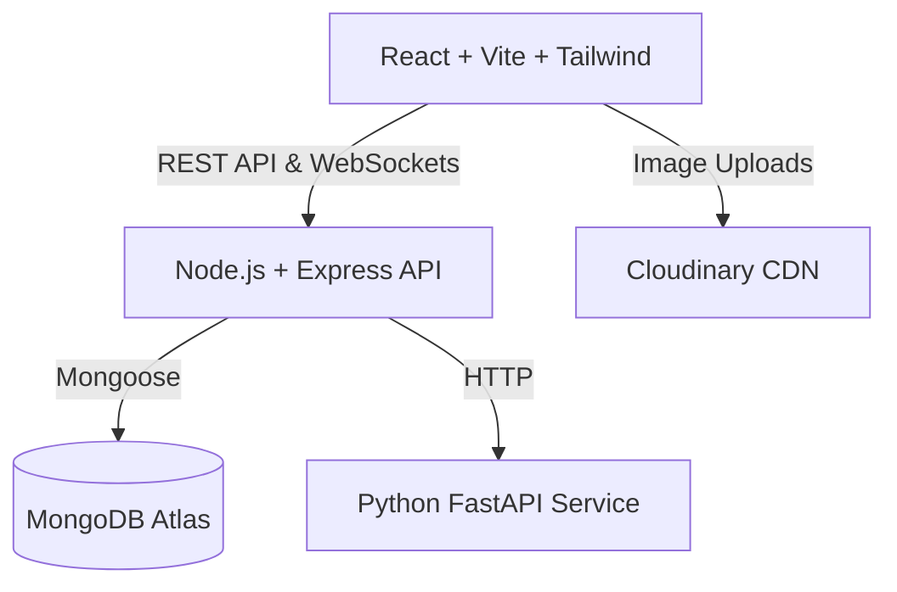

# Collex — The Trusted Campus Marketplace


Collex is a premium, multi-tenant marketplace designed exclusively for university students. It solves the problem of graduating seniors discarding perfectly good items and incoming freshmen buying expensive new ones by providing a secure, college-isolated platform to buy, sell, rent, and barter.

## 🚀 Features

- **Strict Multi-Tenancy:** Users are isolated to their specific campus. A student at Stanford cannot see listings from MIT.
- **Role-Based Access Control:** Differentiated roles (`STUDENT`, `COLLEGE_ADMIN`, `SUPER_ADMIN`).
- **Signature Campus Features:**
  - **Graduation Mode:** Group multiple items into a "Leaving Campus Sale" bundle.
  - **Barter System:** "I have X, I want Y" exchange proposals with cash adjustments.
  - **Wanted Board:** Post specific requests for items you need.
  - **Course-Aware Discovery:** Recommendations based on department and graduation year.
- **Machine Learning Integration:**
  - **Price Intelligence:** FastAPI Python service predicting fair market prices.
  - **Collex Shield:** Risk-assessment engine warning buyers about anomalies.
- **Real-Time Communication:** Secure Socket.IO chat rooms for negotiating offers.

## 🏗️ Architecture



## 🛠️ Technology Stack

| Domain | Technologies |
|---|---|
| **Frontend** | React 18, TypeScript, Tailwind CSS, Vite, Lucide Icons |
| **Backend** | Node.js, Express, TypeScript, Socket.IO, JWT Auth |
| **Database** | MongoDB (Mongoose), Cloudinary (Images) |
| **ML Service** | Python 3.11, FastAPI, scikit-learn, pandas |
| **Testing** | Node.js native test runner, Supertest |
| **DevOps** | Docker, Docker Compose |

## 💻 Local Setup

### Prerequisites
- Node.js (v20+)
- Python (v3.11+)
- Docker (optional, for running everything at once)
- MongoDB instance (local or Atlas)

### 1. Clone & Install
```bash
git clone https://github.com/dhiraj-init/Collex.git
cd Collex

# Install all dependencies (Monorepo)
npm install
npm --prefix server install
npm --prefix client install
npm --prefix ml-service install -r requirements.txt
```

### 2. Environment Variables
Create a `.env` file in the `server` directory:
```env
PORT=5000
NODE_ENV=development
MONGODB_URI=mongodb://localhost:27017/collex
JWT_SECRET=your_super_secret_jwt_key
JWT_EXPIRES_IN=7d
CLIENT_URL=http://localhost:5173
ML_SERVICE_URL=http://localhost:8000
CLOUDINARY_CLOUD_NAME=your_cloud_name
CLOUDINARY_API_KEY=your_api_key
CLOUDINARY_API_SECRET=your_api_secret
```

### 3. Run Development Servers
```bash
# Run the entire Node+React stack
npm run dev

# In a separate terminal, start the Python ML Service
cd ml-service
uvicorn main:app --reload --port 8000
```

### 4. Running with Docker Compose
If you prefer running the entire stack via Docker:
```bash
docker compose up -d
```

## 🧪 Testing
```bash
# Run backend API test suite
npm --prefix server run test
```
*Note: A running MongoDB connection is required to run the test suite successfully.*

## 📚 Documentation
- [Security Architecture](./docs/SECURITY.md)
- [Multi-Tenancy Setup](./docs/MULTI_TENANCY.md)
- [Price ML Model](./docs/PRICE_MODEL.md)
- [Collex Shield](./docs/COLLEX_SHIELD.md)
- [Interview Guide](./docs/INTERVIEW_GUIDE.md)

## 🔮 Future Roadmap
1. Migrate from `bcrypt` to `Argon2` for enhanced password security.
2. Implement Redis for caching heavily accessed public campus listings.
3. Replace deterministic recommendations with a collaborative filtering ML model.
