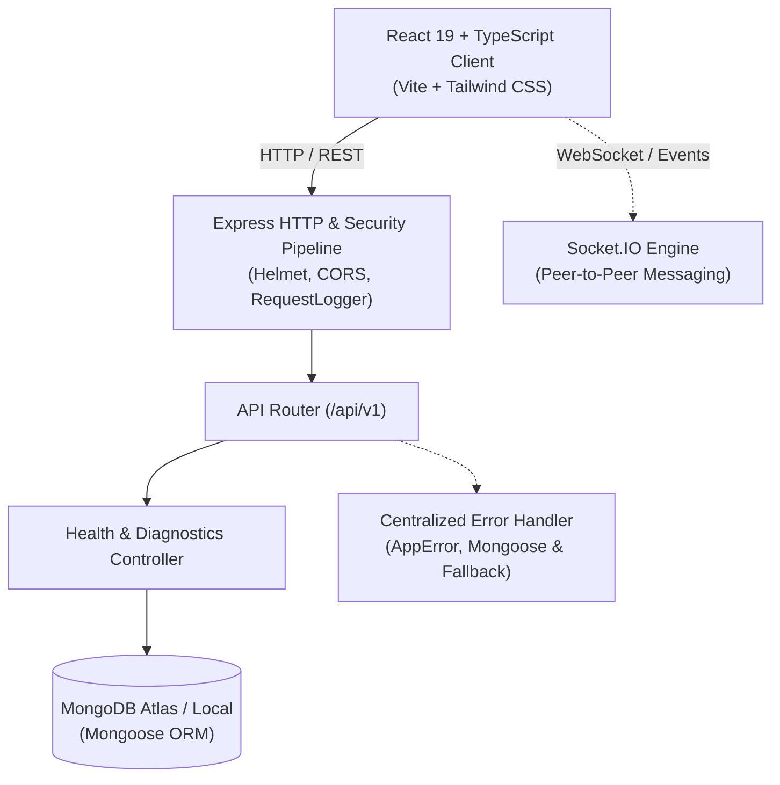

# Collex Architecture Specification (Phase 0)

> **Collex** is a production-quality, hyperlocal peer-to-peer marketplace engineered exclusively for verified college students to buy, sell, rent, exchange, and giveaway items safely within their campus community.

---

## 1. System High-Level Overview

In a typical university setting, commerce happens through unorganized WhatsApp groups, Discord servers, or public marketplaces where scammers, non-students, and geographically distant sellers create friction. 

Collex solves this by enforcing **campus-level tenant isolation**:
- **Campus Email Verification**: Only users with verified `.edu` (or institutional) email domains belonging to recognized colleges can join.
- **Hyperlocal Scope**: By default, listings, chats, and offers are scoped strictly to the student's own campus community.
- **In-Person Safe Meetups**: Transactions are physical handoffs on campus (e.g., library lobby, student union) accompanied by one-time verification codes.



---

## 2. Monorepo Directory Topology

Collex uses a clean, lightweight monorepo architecture:

```text
collex/
├── client/                     # Frontend Application (React + Vite + TypeScript)
│   ├── src/
│   │   ├── components/common/  # Reusable UI foundations (Header, Footer, HealthPanel)
│   │   ├── config/             # Typed environment access (env.ts)
│   │   ├── services/           # HTTP API client layer (apiClient.ts)
│   │   ├── types/              # Domain models and API response envelopes
│   │   ├── App.tsx             # Root application view
│   │   └── index.css           # Tailwind v4 configuration and design tokens
│   ├── .env.example            # Client environment variables
│   ├── package.json            # Client dependencies and build scripts
│   └── vite.config.ts          # Vite build pipeline
│
├── server/                     # Backend API Service (Node.js + Express + TypeScript)
│   ├── src/
│   │   ├── config/             # DB connection (db.ts) and env validation (env.ts)
│   │   ├── controllers/        # Business logic controllers (healthController.ts)
│   │   ├── middlewares/        # Express pipeline: error, logging, 404
│   │   ├── routes/             # Route mapping (healthRoutes.ts, index.ts)
│   │   ├── utils/              # Logger, AppError, standardized apiResponse
│   │   ├── app.ts              # Express application factory
│   │   └── server.ts           # Server bootstrap and graceful shutdown lifecycle
│   ├── .env.example            # Server environment variables
│   ├── package.json            # Server dependencies
│   └── tsconfig.json           # Strict TypeScript configuration
│
├── docs/                       # System documentation
│   └── ARCHITECTURE.md         # This specification document
│
├── .gitignore                  # Global Git ignore rules
├── .env.example                # Root environment template
├── LEARNING_NOTES.md           # Developer notes and interview questions
├── package.json                # Monorepo root scripts (dev, build, lint)
└── README.md                   # Project overview and setup instructions
```

---

## 3. Request-Response Lifecycle & Pipeline

Every incoming HTTP request to Collex follows a structured pipeline:

```text
Incoming Request
       │
       ▼
1. Helmet Security Middleware (Sets secure HTTP headers)
       │
       ▼
2. CORS Middleware (Restricts origins to authorized frontend domains)
       │
       ▼
3. Body Parser (express.json, parses incoming JSON payloads up to 10MB)
       │
       ▼
4. Request Logger (Measures execution time, logs method, path, and status code)
       │
       ▼
5. API Router (/api/v1)
       ├── Route Match  ──► Controller Execution ──► Standard JSON Success Response
       │
       └── No Match     ──► 404 Not Found Handler ──► Creates AppError(404)
                                                               │
                                                               ▼
6. Centralized Error Handler ◄─────────────────────────────────┘
       ├── Handles AppError (operational status codes)
       ├── Handles Mongoose CastError (invalid ObjectIds -> 400)
       ├── Handles MongoDB 11000 (duplicate keys -> 409)
       ├── Handles Mongoose ValidationError (schema rules -> 400)
       └── Handles Unexpected Exceptions (masks internal details in prod -> 500)
```

### Standard Response Envelope Format

All responses follow a predictable JSON structure:

#### Success Envelope (`2xx`):
```json
{
  "success": true,
  "statusCode": 200,
  "message": "All systems operational",
  "data": { ... },
  "meta": {
    "timestamp": "2026-09-24T18:48:33.992Z"
  }
}
```

#### Error Envelope (`4xx` / `5xx`):
```json
{
  "success": false,
  "statusCode": 404,
  "message": "Cannot GET /api/v1/unknown - Route not found on this server",
  "errors": null,
  "stack": "Error: ... (included in development only)",
  "meta": {
    "timestamp": "2026-09-24T18:48:56.465Z",
    "path": "/api/v1/unknown"
  }
}
```

---

## 4. Database Strategy & Resilient Lifecycle

The database connection in `server/src/config/db.ts` uses Mongoose with resilience:
1. **Connection State Tracking**: Connection events (`connected`, `error`, `disconnected`) are observed via event listeners.
2. **Degraded Mode Resilience**: If MongoDB is unavailable upon startup, the server logs a warning and boots anyway. This allows the `/api/v1/health` endpoint to stay alive and report a `degraded` state rather than crashing in an unhandled failure loop.
3. **Graceful Disconnection**: During shutdown (`SIGINT` or `SIGTERM`), the database connection is terminated gracefully before the process exits.

---

## 5. Domain Data Model Proposals

The Collex marketplace requires 10 interconnected entities. Below are the architectural schema specifications.

### 1. `College` (Campus Boundary)
*Purpose:* Represents an accredited educational institution. Defines the tenant boundary and authorized email domains.
- `_id`: ObjectId
- `name`: String (e.g., "University of Washington")
- `code`: String (Unique, e.g., "UW-SEATTLE")
- `domains`: [String] (e.g., `["uw.edu", "alumni.uw.edu"]`)
- `location`:
  - `city`: String
  - `state`: String
  - `country`: String
  - `coordinates`: { type: [Number], index: '2dsphere' } (GeoJSON [longitude, latitude])
- `isActive`: Boolean (default: true)
- `createdAt`, `updatedAt`: Date

### 2. `User` (Verified Student)
*Purpose:* Verified student account tied strictly to their college domain.
- `_id`: ObjectId
- `email`: String (Unique, lowercase, must match `College.domains`)
- `passwordHash`: String (Argon2 / bcrypt)
- `fullName`: String
- `collegeId`: ObjectId (Ref -> `College`, indexed)
- `avatarUrl`: String (Cloudinary URL)
- `bio`: String (Max 300 chars)
- `isEmailVerified`: Boolean (default: false)
- `verificationToken`: String (hashed)
- `trustScore`: Number (0-100, default: 50, calculated from ratings & confirmed trades)
- `role`: Enum (`student`, `campus_ambassador`, `admin`)
- `createdAt`, `updatedAt`: Date

### 3. `Listing` (Marketplace Item)
*Purpose:* Represents any item listed on campus for sale, rent, exchange, or giveaway.
- `_id`: ObjectId
- `title`: String (e.g., "Calculus 9th Edition - Stewart")
- `description`: String
- `category`: Enum (`textbooks`, `electronics`, `dorm_essentials`, `appliances`, `fashion`, `notes_study_material`, `bicycles`, `other`)
- `listingType`: Enum (`sell`, `rent`, `exchange`, `free`)
- `price`: Number (0 for `free`)
- `originalPrice`: Number (Optional, for showing student discount)
- `condition`: Enum (`brand_new`, `like_new`, `good`, `fair`)
- `photos`: [String] (Cloudinary secure image URLs, 1 to 5 photos)
- `sellerId`: ObjectId (Ref -> `User`, indexed)
- `collegeId`: ObjectId (Ref -> `College`, indexed for hyperlocal queries)
- `status`: Enum (`active`, `reserved`, `completed`, `archived`)
- `viewsCount`: Number (default: 0)
- `likesCount`: Number (default: 0)
- `tags`: [String]
- `createdAt`, `updatedAt`: Date
*Compound Index:* `{ collegeId: 1, status: 1, category: 1 }`

### 4. `Conversation` (Buyer-Seller Chat Channel)
*Purpose:* A 1-to-1 conversation room tied to a specific listing.
- `_id`: ObjectId
- `listingId`: ObjectId (Ref -> `Listing`, indexed)
- `buyerId`: ObjectId (Ref -> `User`, indexed)
- `sellerId`: ObjectId (Ref -> `User`, indexed)
- `lastMessageSnippet`: String
- `lastMessageAt`: Date
- `unreadCountBuyer`: Number (default: 0)
- `unreadCountSeller`: Number (default: 0)
- `createdAt`, `updatedAt`: Date
*Compound Unique Index:* `{ listingId: 1, buyerId: 1 }` (ensures one thread per buyer per listing)

### 5. `Message` (Chat Message)
*Purpose:* An individual text or media message sent within a conversation.
- `_id`: ObjectId
- `conversationId`: ObjectId (Ref -> `Conversation`, indexed)
- `senderId`: ObjectId (Ref -> `User`, indexed)
- `receiverId`: ObjectId (Ref -> `User`)
- `content`: String
- `mediaUrls`: [String] (Optional images uploaded during negotiation)
- `isRead`: Boolean (default: false)
- `readAt`: Date
- `createdAt`: Date

### 6. `Offer` (Price Negotiation)
*Purpose:* Formal proposal from a buyer to buy or exchange an item at a specific price.
- `_id`: ObjectId
- `listingId`: ObjectId (Ref -> `Listing`, indexed)
- `buyerId`: ObjectId (Ref -> `User`, indexed)
- `sellerId`: ObjectId (Ref -> `User`, indexed)
- `offeredPrice`: Number
- `notes`: String (e.g., "Can meet today at South Campus Hub")
- `status`: Enum (`pending`, `accepted`, `rejected`, `countered`, `expired`)
- `counterPrice`: Number (Optional)
- `createdAt`, `updatedAt`: Date

### 7. `Transaction` (Safe Meetup & Settlement)
*Purpose:* Created once an offer is accepted. Coordinates safe physical campus handoff.
- `_id`: ObjectId
- `listingId`: ObjectId (Ref -> `Listing`)
- `offerId`: ObjectId (Ref -> `Offer`)
- `buyerId`: ObjectId (Ref -> `User`, indexed)
- `sellerId`: ObjectId (Ref -> `User`, indexed)
- `collegeId`: ObjectId (Ref -> `College`, indexed)
- `agreedPrice`: Number
- `status`: Enum (`pending_meetup`, `completed`, `cancelled`, `disputed`)
- `meetupLocation`: String (e.g., "Odegaard Library Front Steps")
- `verificationCode`: String (6-digit hashed one-time token confirmed at handover)
- `completedAt`: Date
- `cancelledAt`: Date
- `createdAt`: Date

### 8. `Review` (Student Trust Feedback)
*Purpose:* Post-transaction mutual review building student trust scores.
- `_id`: ObjectId
- `transactionId`: ObjectId (Ref -> `Transaction`, unique)
- `reviewerId`: ObjectId (Ref -> `User`, indexed)
- `revieweeId`: ObjectId (Ref -> `User`, indexed)
- `rating`: Number (1 to 5 integer)
- `comment`: String (Max 500 chars)
- `tags`: [String] (e.g., `["punctual", "accurate_description", "fair_pricing"]`)
- `createdAt`: Date

### 9. `Report` (Campus Moderation)
*Purpose:* Flags scam attempts, harassment, prohibited items, or fake student profiles.
- `_id`: ObjectId
- `reporterId`: ObjectId (Ref -> `User`, indexed)
- `targetType`: Enum (`listing`, `user`, `message`)
- `targetId`: ObjectId
- `reason`: Enum (`prohibited_item`, `scam`, `harassment`, `incorrect_campus`, `spam`, `other`)
- `description`: String
- `status`: Enum (`pending`, `under_review`, `resolved`, `dismissed`)
- `resolvedByAdminId`: ObjectId (Ref -> `User`)
- `createdAt`, `updatedAt`: Date

### 10. `Notification` (Alerts Engine)
*Purpose:* In-app and push notifications for chat messages, offers, and safety updates.
- `_id`: ObjectId
- `recipientId`: ObjectId (Ref -> `User`, indexed)
- `type`: Enum (`new_message`, `offer_received`, `offer_accepted`, `offer_rejected`, `meetup_scheduled`, `transaction_completed`, `review_received`, `system_alert`)
- `title`: String
- `body`: String
- `linkUrl`: String
- `isRead`: Boolean (default: false, indexed)
- `createdAt`: Date

---

## 6. Realtime, Media, and Machine Learning Roadmap

| Component | Technology | Target Phase | Responsibility |
| :--- | :--- | :--- | :--- |
| **Realtime Messaging** | Socket.IO | Phase 3 | Instant chat, typing status, unread badges |
| **Media Delivery** | Cloudinary CDN | Phase 2 | Optimized student photo uploads with auto-thumbnailing |
| **Campus Auth** | JWT + HTTP-only cookies | Phase 1 | Domain-verified authentication |
| **Smart Recommendations & Fraud ML** | Python + FastAPI + scikit-learn | Future Phase | Price anomaly detection & category auto-tagging |
